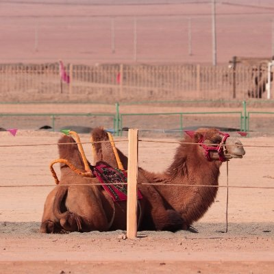

 

# About
プログラミングを学んで便利なものを作りたい。  
プログラミングを学んで世の中の不合理をみ〜んな無くしたい

# アイコン画像

# Profile
-　ハンドルネーム：　Molly  
-　所在地：　関西圏  
-　プログラミング勉強中！  

# Skills 
- Github
- markdown
- JavaScript
- Node.js(Express.Webpack)
- ITパスポート

# Works
- [Github](https://github.com/moritat-222)
- [Qiita](https://qiita.com/Molly95554907)
- [予定調整くん（N予備校にて制作）](https://stormy-plains-02260.herokuapp.com/)
- [FizzBuzzナベアツ](https://moritat-222.github.io/FizzBuzzNabeatsu/Nabeatsu.html)  

<blockquote class="twitter-tweet">
N予備校開始3日目。 JavaScriptの繰り返し処理を使い、「3の倍数でアホになる世界のナベアツ氏」のループを作って遊ぶ🤣🤣👏👏<a href="https://twitter.com/hashtag/%E4%BB%8A%E6%97%A5%E3%81%AE%E7%A9%8D%E3%81%BF%E4%B8%8A%E3%81%92?src=hash&amp;ref_src=twsrc%5Etfw">#今日の積み上げ</a> <a href="https://twitter.com/hashtag/N%E4%BA%88%E5%82%99%E6%A0%A1?src=hash&amp;ref_src=twsrc%5Etfw">#N予備校</a> <a href="https://twitter.com/hashtag/%E5%AE%BF%E9%A1%8C?src=hash&amp;ref_src=twsrc%5Etfw">#宿題</a> <a href="https://twitter.com/hashtag/%E3%83%97%E3%83%AD%E3%82%B0%E3%83%A9%E3%83%9F%E3%83%B3%E3%82%B0?src=hash&amp;ref_src=twsrc%5Etfw">#プログラミング</a> <a href="https://t.co/NsDXXOnHXu">pic.twitter.com/NsDXXOnHXu</a>
&mdash; Molly@プログラミング勉強中 (@Molly95554907) <a href="https://twitter.com/Molly95554907/status/1235578238077935616?ref_src=twsrc%5Etfw">March 5, 2020</a></blockquote> 

- [dancing○△□](https://www.openprocessing.org/sketch/872163)
<iframe src="https://www.openprocessing.org/sketch/872163/embed/" width="600" height="450"></iframe>

# Contact
- [Twitter](https://twitter.com/Molly95554907)  

<a class="twitter-timeline" data-width="400" data-height="400" data-theme="dark" href="https://twitter.com/Molly95554907?ref_src=twsrc%5Etfw">Tweets by Molly95554907</a> 

# History
- 2019年4月　大学卒業
- 2020年3月　N予備校入学

# 最近はまっているもの  

<iframe width="560" height="315" src="https://www.youtube.com/embed/qOiDlprXF2w" frameborder="0" allow="accelerometer; autoplay; encrypted-media; gyroscope; picture-in-picture" allowfullscreen></iframe>

# 元気が出る動画  

<noscript><a href="https://www.nicovideo.jp/watch/sm8425342">【手描き】ジョジョの画像で「リズム天国ゴールドエクスペリエンス」</a></noscript>

